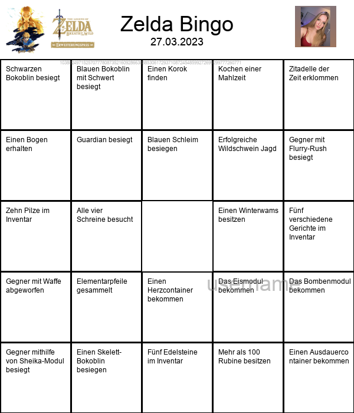

# Stream Bingo Generator

Der Stream Bingo Generator ist ein Python-Skript, das eine zufällige Bingo-Karte auf Basis einer Liste von Aufgaben aus den Dateien in Games erstellt. Dieses Skript verwendet die **Python Imaging Library** (PIL), um die Bingo-Karte als Bild zu erstellen und anzuzeigen.

In diesem Projekt werden Wasserzeichen auf den generierten Bingo-Karten verwendet, um sicherzustellen, dass alle Benutzer:innen bei Verwendung des gleichen Seeds stets identische Karten erhalten. Dies ist besonders wichtig für kompetitive Veranstaltungen, bei denen die Karten zur Überprüfung der Gültigkeit nachvollziehbar sein müssen. Durch die Implementierung der Wasserzeichen können die Benutzer:innen die Karten einfach selbst generieren und so die Übereinstimmung mit den Karten anderer Teilnehmer:innen überprüfen. Dies stellt sicher, dass die Karten für Turniere und Wettbewerbe geeignet und manipulationssicher sind. Das Wasserzeichen selbst enthält den Seed-Wert und ermöglicht es den Benutzer:innen, die Karte mithilfe dieses Seeds reproduzieren und ihre Gültigkeit überprüfen zu können.



## MyBinder

Sie können das Script mit myBinder direkt testen:
[](https://mybinder.org/v2/gh/Zeddi92/SixPlusNiceBingo.git/HEAD?labpath=Bingo.ipynb)

## Voraussetzungen
Um dieses Skript auszuführen, benötigen Sie die folgenden Abhängigkeiten:

* Python 3.x
* PIL (Pillow)
* requests

Installieren Sie die Abhängigkeiten mit dem folgenden Befehl:
```
pip install pillow requests
```
## Unterstützung für mehrere Spiele
Dieses Projekt unterstützt jetzt mehrere Spiele als übergeordnete Kategorien. Um dies zu erreichen, werden die Aufgaben für jedes Spiel in einer separaten Textdatei im Ordner "Games" gespeichert. Jede Textdatei ist nach dem Namen des Spiels benannt (z. B. `zelda_botw.txt` für **"Zelda: Breath of the Wild"**).

### Struktur der Spiele-Dateien

Jede Spiel-Datei enthält die Aufgaben und Regionen in folgendem Format:
```
---REGION: Region A---
Aufgabe 1 in Region A
Aufgabe 2 in Region A
---REGION: Region B---
Aufgabe 1 in Region B
Aufgabe 2 in Region B
```
Trennen Sie die Aufgaben für verschiedene Regionen mit einer speziellen Zeile, zum Beispiel `---REGION: RegionName---`. Ersetzen Sie **"RegionName"** durch den tatsächlichen Namen der Region.

### Auswahl eines Spiels im Skript
Zu Beginn des Skripts können Sie das gewünschte Spiel auswählen, indem Sie die `game_name`-Variable entsprechend ändern:
```
game_name = "zelda_botw"  # Ersetzen Sie dies durch den gewünschten Spielnamen
```
Das Skript liest dann die Aufgaben und Regionen aus der entsprechenden Textdatei im Ordner "**Games**" und generiert die Bingo-Karte basierend auf der ausgewählten Region des ausgewählten Spiels.

## Verwendung

1. Legen Sie die Datei "botw_input.txt" im selben Verzeichnis wie das Skript ab. Diese Datei sollte eine Liste von Aufgaben enthalten, die durch Zeilenumbrüche getrennt sind.
2. Öffnen Sie das Skript und ändern Sie die Variablen image_url und avatar_url entsprechend Ihren Anforderungen.
3. Führen Sie das Skript aus, indem Sie dieses Git in Jupyter Notebook öffnen.
4. Das Bild wird temporär gespeichert wird. Sie können das Bild im Anschluss links über den File-Browser aufrufen und speichern.

## Anpassungen

Sie können das Skript an Ihre Bedürfnisse anpassen, indem Sie die folgenden Variablen ändern:

* **seed_str**: Ändern Sie diesen Wert, um einen anderen Seed für die Zufallsfunktion zu verwenden. Dies führt zu einer anderen Aufgabenzuordnung auf der Bingo-Karte.
* **CARD_SIZE**: Ändern Sie die Größe der Bingo-Karte.
* **FONT_NAME**: Ändern Sie den Namen der Schriftart, die für den Text auf der Bingo-Karte verwendet wird.
* **image_url**: Ändern Sie die URL des Bildes, das auf der Bingo-Karte angezeigt wird.
* **avatar_url**: Ändern Sie die URL des Avatars, der auf der Bingo-Karte angezeigt wird.

## Dokumentation

Das Skript ist in mehrere Abschnitte unterteilt, die verschiedene Aufgaben erfüllen:

1. Importieren der erforderlichen Bibliotheken und Festlegen von Konstanten.
2. Einlesen der Aufgaben aus der Datei "botw_input.txt".
3. Erzeugen eines Seeds und Mischen der Aufgabenliste basierend auf dem Seed.
4. Hinzufügen von Titel und Erstelldatum zur Bingo-Karte.
5. Laden des Bildes und des Avatars von ihren jeweiligen URLs.
6. Erstellen der Bingo-Karte und Zeichnen der Aufgaben, des Bildes und des Avatars darauf.
7. Anzeigen der erstellten Bingo-Karte.

Das Hauptaugenmerk des Skripts liegt auf der Erstellung der Bingo-Karte. Dazu wird eine leere Karte erstellt und dann mit Aufgaben, Bildern und Avataren gefüllt. Die Aufgaben werden in einer 5x5-Matrix angeordnet, wobei die mittlere Zelle als "FREE" (frei) markiert ist. Die Größe der Karte, die Schriftart und andere visuelle Elemente können über die entsprechenden Variablen angepasst werden.
Die Bingo-Karte wird als Bild im RGBA-Modus erstellt, und die verschiedenen Elemente werden darauf gezeichnet. Die Funktion **alpha_composite()** wird verwendet, um ein Wasserzeichen auf die Karte zu legen. Schließlich wird die erstellte Bingo-Karte mit der Funktion **display()** aus der **IPython.display**-Bibliothek angezeigt.

## Zusammenfassung

Der Zelda Bingo Generator ist ein Python-Skript, das eine zufällige Bingo-Karte auf Basis einer Liste von Aufgaben aus der Datei "botw_input.txt" erstellt. Das Skript verwendet die Python Imaging Library (PIL), um die Bingo-Karte als Bild zu erstellen und anzuzeigen. Die Anleitung in der README-Datei erklärt, wie Sie das Skript ausführen und an Ihre Bedürfnisse anpassen können.
